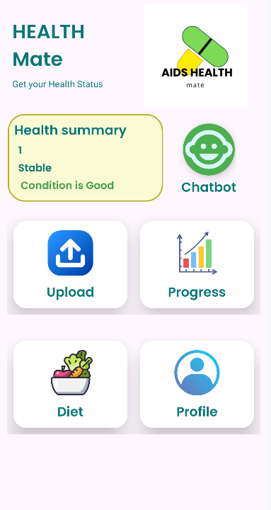
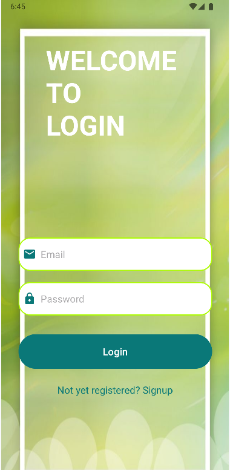
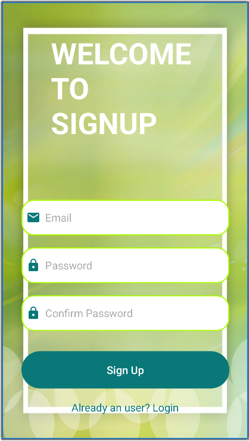
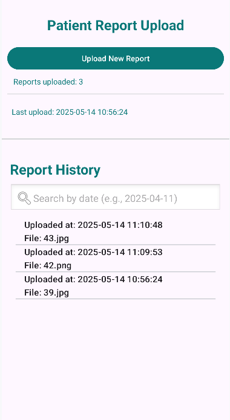
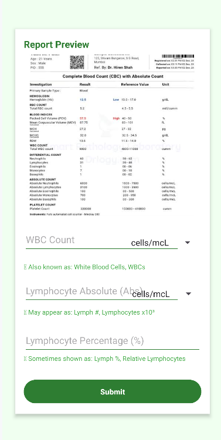
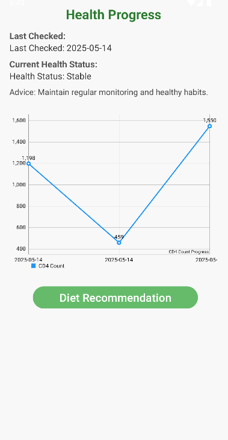
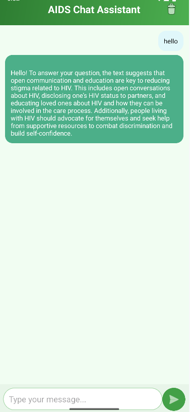

# AIDS Tracker & Management App

An Android application integrated with Machine Learning to help patients and doctors manage and monitor HIV/AIDS progression.

The app allows patients to upload medical reports, track CD4/CD8 counts, visualize progress with graphs, and get stage predictions with recommendations for diet and medication.

#  Features

📤 Report Upload – Patients can upload blood test reports (CD4/CD8 counts).

📊 Progress Tracking – Graphs showing health improvement, decline, or stability.

🧠 ML Model Integration – Predicts:

         Current HIV stage (based on CD4/CD8 counts).

💬 Chatbot – Provides guidance, FAQs, and patient support.

📋 Diet & Medicine Recommendations – Personalized suggestions based on stage.

🔒 Login & Signup.

# 🛠️ Tech Stack

Frontend (Mobile App): Android (Java + XML, Android Studio)

Backend (API): FastAPI (Python)

Database: SQLite

Machine Learning:

     Used Classification models (Random Forest):

     CD4/CD8 trend prediction

     Hiv Stage Detection
     

# Screenshots of project 

Home Page

Login Page

Signup Page

Upload Page

Extract Info. Page

Chart Page

Chatbot

Diet Page

